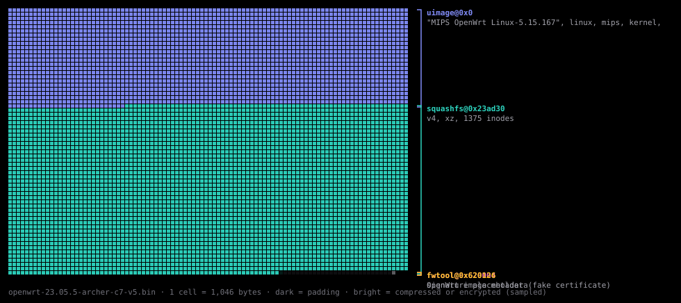

<div align="center">

# fwtriage

**Fast, evidence-first security triage for firmware images.**

Hand it a firmware image. In seconds it tells you what is inside, where the risk is, and
how to see each finding with your own eyes.

[](https://github.com/voidgrupo/fwtriage/actions/workflows/ci.yml)
[](https://pypi.org/project/fwtriage/)
[](https://pypi.org/project/fwtriage/)
[](./LICENSE)

</div>

---

```console
$ pipx install fwtriage
$ fwtriage openwrt-23.05.5-archer-c7-v5.bin
```

```text
fwtriage 0.1.0  openwrt-23.05.5-archer-c7-v5.bin
6,422,856 bytes  sha256 facfda629ba2da591ad60f2542e004600fdcc84550376ecefbda02f12dad1268

layout
  uimage@0x0                            2.2 MiB  "MIPS OpenWrt Linux-5.15.167", linux, mips, kernel, lzma
    kernel                              2.2 MiB  at 0x40
      lzma@0x0                          2.2 MiB
        elf@0x6bf000                             MIPS 32-bit
        cpio@0x777080                     512 B  newc  0 files
        dtb@0x7772a0                    8.7 KiB  device tree, TP-Link Archer C7 v5
  squashfs@0x23ad30                     3.9 MiB  v4, xz, 1375 inodes  1051 files
  fwtool@0x620004                         290 B  OpenWrt image metadata
  fwtool@0x620126                          34 B  signature placeholder (fake certificate)

components
  busybox          1.36.1-1       -          /usr/lib/opkg/status
  dnsmasq          2.90-2         -          /usr/lib/opkg/status
  dropbear         2022.82-6      -          /usr/lib/opkg/status
  hostapd          2.11-devel     -          /usr/sbin/wpad
  linux            5.15.167       -          /usr/lib/opkg/status
  mbedtls          2.28.9-1       -          /usr/lib/opkg/status
  musl             1.2.4-4        -          /usr/lib/opkg/status
  wpa_supplicant   2.11-devel     -          /usr/sbin/wpad
  and 140 more packages from the package database (see --json or --sbom)

hardening (MIPS)
  stack protector  ██████████████████░░░░░░ 33/44
  non-exec stack   ████████████████████████ 44/44
  pie              █████████░░░░░░░░░░░░░░░ 16/44
  full relro       ████████████████████████ 44/44
  fortify          ░░░░░░░░░░░░░░░░░░░░░░░░ 0/44

findings (6)
  HIGH     account 'root' has no password  FWT-ACC-001 · confirmed
           squashfs@0x23ad30 › /etc/shadow:1
           root::  shell /bin/ash
  MEDIUM   no signature found in the image  FWT-SIG-001 · likely
           openwrt-23.05.5-archer-c7-v5.bin
           uimage@0x0: crc32; fwtool@0x620126: fwtool placeholder signature
  MEDIUM   console 'default' opens a shell through /usr/libexec/login.sh  FWT-SVC-001 · likely
           squashfs@0x23ad30 › /etc/inittab:3
           ::askconsole:/usr/libexec/login.sh → /usr/libexec/login.sh: [ "$(uci -q get system.@system[0].ttylogin)" = 1 ]
  LOW      11 of 44 dynamically linked executables without stack protector  FWT-HRD-001 · confirmed
           squashfs@0x23ad30
           /bin/ubus, /sbin/askfirst, /sbin/jffs2reset, /sbin/logd, /sbin/mount_root, /sbin/uci, /sbin/udevtrigger, /sbin
  LOW      28 of 44 executables without position independence  FWT-HRD-003 · confirmed
           squashfs@0x23ad30
           /bin/busybox, /bin/opkg, /bin/uclient-fetch, /sbin/jffs2reset, /sbin/kmodloader, /sbin/logd, /sbin/logread, /s
  INFO     7 network daemons started at boot  FWT-SVC-004 · confirmed
           squashfs@0x23ad30 › /etc/init.d/dnsmasq:7
           dnsmasq (conditional), dropbear (conditional), hostapd (conditional), ntpd (conditional), odhcpd, uhttpd (cond
```

That is the real output on the public OpenWrt 23.05.5 image for the TP-Link Archer C7 v5,
about one second on a laptop. The console finding is `likely`, not `confirmed`: the shell
is reached through `login.sh`, and only a setting written on first boot decides it. The unabridged run is in
[`docs/assets/openwrt-scan.txt`](./docs/assets/openwrt-scan.txt). It is pinned by SHA-256 in the opt-in
suite (`./check realworld`) together with a Broadcom TRX and an ARM64 FIT image, each
checked against `readelf`, `unsquashfs` and `dtc`, so the results never drift silently.

<p align="center">
  
</p>

## Why another firmware tool

Most firmware tooling either **extracts** (binwalk, unblob) or **runs a long pipeline**
(EMBA, FACT). fwtriage sits in between. It answers one question fast and precisely: *is
this image worth a closer look, and where?*

- **Precision before coverage.** A finding is reported only when it can be defended.
  Something that is only a hint is labeled `indicator` and never gets a confirmed
  severity. A PEM header with no body, a daemon that only appears in a `stop` branch, or a
  version string inside help text produces nothing.
- **Evidence on every finding.** You get the artifact path, the entry, the line or byte
  offset, an excerpt, and a command that shows you the same thing.
- **Nothing to install around it.** It is pure Python, uses no external binaries and makes
  no network calls unless you pass `--online`. It installs with one command on Linux,
  macOS and Windows.
- **Built for CI.** Output is deterministic, exit codes are policy-driven, and it emits
  SARIF 2.1.0 for GitHub code scanning and a CycloneDX 1.5 SBOM.

## What it looks at

| Area | What fwtriage reports |
|---|---|
| **Layout** | containers, compression and filesystems, unpacked recursively, including an update image shipped inside the root filesystem |
| **Accounts** | login accounts without a password, weak hash schemes, fixed hashes, extra UID 0 accounts |
| **Secrets** | private keys verified by structure, cloud access keys, Wi-Fi passphrases in configuration, factory `authorized_keys` |
| **Services** | a shell on the console without login, telnet at boot (and telnet whose login program is a shell), SSH that accepts empty passwords, cleartext daemons, the network daemons that actually start |
| **Components** | name and version from opkg, dpkg and apk databases (`confirmed`) and from anchored strings in binaries (`likely`), named after the upstream project, with CPE and purl |
| **Hardening** | stack protector, non-executable stack, PIE, full RELRO and fortify, read from program headers so stripped binaries are judged correctly |
| **Vulnerabilities** | with `--online`, NVD matches per component, graded by CVSS and cached locally |
| **Signing and verified boot** | whether the image is signed at all, weak algorithms and keys (SHA-1, RSA below 2048), FIT images signed per image instead of per configuration, configurations that leave images unsigned, and U-Boot verification keys that are not `required` |
| **Integrity** | payload checksum mismatches, unidentified high-entropy spans, and how much of the image belongs to no recognized region |

The 27 rules, with severity and CWE mapping, are in [`docs/rules.md`](./docs/rules.md).
Signing is judged from what the image declares — presence, algorithm, key size and what
each signature covers; fwtriage has no trusted key, so it does not check that a signature
verifies.

### Formats

| Kind | Formats |
|---|---|
| Container | U-Boot legacy uImage, U-Boot FIT, Broadcom TRX, UBI |
| Compression | gzip, xz, LZMA, bzip2; zstd and LZO with `fwtriage[native]` |
| Filesystem | SquashFS 4, CramFS (both endians), JFFS2 (zlib, LZMA, rtime), CPIO (newc, crc) |
| Package | tar, zip (vendor downloads and sysupgrade images) |
| Identified | ELF, flattened device tree (with its board and U-Boot verification keys), PEM, OpenWrt `fwtool` trailer |

## Usage

```console
$ fwtriage scan firmware.bin                       # terminal report
$ fwtriage scan firmware.bin --json report.json --sarif report.sarif --sbom sbom.cdx.json --map map.svg
$ fwtriage scan firmware.bin --online              # add NVD matches (NVD_API_KEY makes it faster)
$ fwtriage scan ./extracted-rootfs/                # a directory works too
$ fwtriage unpack firmware.bin -o out/             # write every filesystem, safely, to disk
$ fwtriage rules                                   # the catalog
$ fwtriage explain FWT-SVC-002
```

| Exit code | Meaning |
|---|---|
| `0` | nothing reached the policy threshold |
| `1` | at least one finding reached it |
| `2` | usage or policy error |
| `3` | the image could not be analyzed |

### In CI

```yaml
- run: pipx install fwtriage
- run: fwtriage scan build/firmware.bin --sarif fwtriage.sarif --fail-on high
- uses: github/codeql-action/upload-sarif@v3
  if: always()
  with:
    sarif_file: fwtriage.sarif
```

This repository runs exactly that against its own test corpus on every push; see the
`self-scan` job in [`.github/workflows/ci.yml`](./.github/workflows/ci.yml).

### Policy

`fwtriage.toml`, or `[tool.fwtriage]` in `pyproject.toml`, found upward from the current
directory:

```toml
fail-on = "high"            # info, low, medium, high, critical
min-confidence = "likely"   # indicator, likely, confirmed

[limits]                    # extraction budget; exhausting it is a notice, never a crash
depth = 8
entry-bytes = 268435456

[[ignore]]
rule = "FWT-HRD-003"
path = "/usr/bin/*"
reason = "vendor toolchain without PIE; tracked in PLAT-412"   # mandatory, echoed in the report
```

### As a library

```python
from fwtriage import scan, Severity

report = scan("firmware.bin")
for finding in report.findings:
    if finding.severity >= Severity.HIGH:
        print(finding.rule, finding.title, finding.location.render())
```

## Safe on hostile input

fwtriage reads firmware that may have been built to break the tools that read it. These
guarantees are hard rules in [`ARCHITECTURE.md`](./ARCHITECTURE.md), and each one is
enforced by a test that fails the build:

- **No parser trusts a size from the image.** Every read is bounded. Every format is
  fuzzed with Hypothesis on random bytes and on mutated images, and the only accepted
  outcomes are a result or a typed error.
- **Decompression bombs are a notice, not a crash.** Total bytes, bytes per entry,
  nesting depth and entry count all have a budget.
- **Extraction stays in memory.** `unpack` writes only under the directory you give it.
  Links are rewritten to point inside it, and a link from the image is never followed.
- **No external processes, no network without `--online`.**
- **Same input, same output.** Every report format is compared byte for byte across runs
  with different hash seeds.

## How it is built

The project is governed by a written norm. Code that diverges from it is a defect.

- [`ARCHITECTURE.md`](./ARCHITECTURE.md): hard rules, decisions, layers and conventions.
- [`FEATURES.md`](./FEATURES.md): what the program does, what it refuses to do, and the
  milestones.
- [`docs/architecture/`](./docs/architecture/): formats, analyzers, testing and guards.

Quality comes from a **hostile synthetic corpus with an answer key**. Independent writers
build SquashFS, CramFS, JFFS2, CPIO, uImage, FIT, TRX and ELF from scratch, and compose
images with vendor headers, broken checksums, truncated streams, deep nesting, a
decompression bomb and false-positive bait. The expected findings are compared exactly: a
missed finding fails, and so does an extra one. The CramFS and CPIO writers were
cross-checked against `fsck.cramfs`, GNU `cpio` and `bsdtar`.

```console
$ ./check all      # format, lint, strict types, unit, guards, coverage floors, corpus
```

## What it is not

It does not emulate or run firmware (see EMBA, FirmAE). It is not a universal extractor
(see binwalk, unblob), and it does not decompile (see Ghidra). It never claims a finding
is exploitable. It reads images, not live devices.

## Contributing

Issues and pull requests are welcome; start with [`CONTRIBUTING.md`](./CONTRIBUTING.md).
To report a vulnerability in fwtriage itself, follow [`SECURITY.md`](./SECURITY.md).

## License

Apache-2.0. Built and maintained by [Void Security](https://voidsec.com.br), an offensive
security company focused on firmware, embedded systems and applied cryptography.
